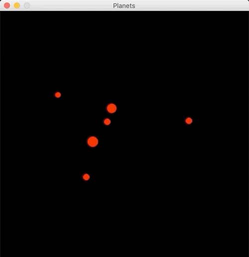

# planets
Minimal implementation for planetary system ([_n_-body problem](https://en.wikipedia.org/wiki/N-body_problem)) with pygame and numpy. It prints the FPS and the sum of mass*velocity once per second in your terminal. To stop drifting of the planets, an additional planet is added with a velocity vector which is the opposite of the sum of all (randomly generated) planets' velocity vectors.

For more details, see my [blog post](https://xn--wxa.ml/posts/planets/).



## Setup
Create env and install requirements:

```bash
virtualenv -p python3 env
source env/bin/activate
pip install -r requirements.txt
```

Run it:

```bash
python planets.py
```